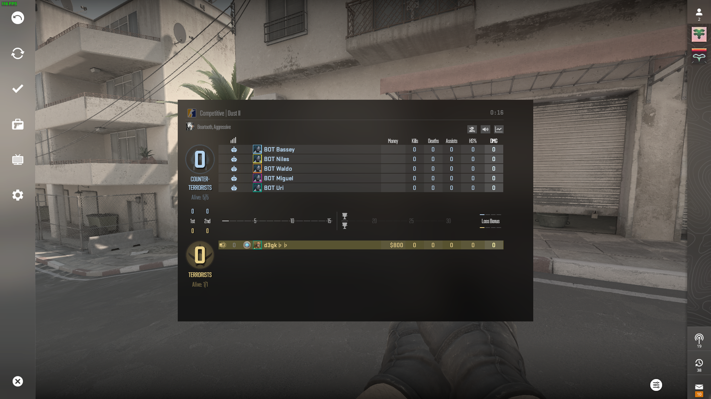

# CS2-to-CSGO mod info

# Overall info

## This is for debug purposes, not for commercial use!

- This will not include a tutorial on how to do it.
- This is purely as is and will probably not get fixed every time a update breaks the ui.

## All credit goes to d3gk. He did all of the work, i only gave him some suggestions and some fixes for some stuff

# Overview

## Main Menu

- CS:GO

- CS2

- MOD

## Loading Screen

- CS:GO

- CS2

- MOD

## HUD

- CS:GO

- CS2

- MOD

## Pause Menu

- CS:GO

- CS2

- MOD

# Changes

## Main Menu

- Fixed tooltips
- Added in-game buttons
- Removed dot pattern

## End Of Match

- Re-Designed all panels

## Loading Screen

- Added CS:GO Loading screen

## HUD

- Added CS:GO-like HUD
